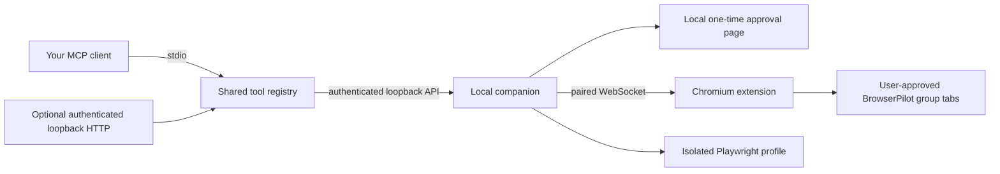

# Architecture

`lib/tools.ts` registers the complete tool surface. `mcp/server.ts` constructs
the standard MCP server; `cli/` manages private configuration and an owned
companion process. `app/api/mcp/` offers the optional loopback HTTP transport.
There is no provider API key and no required hosted BrowserPilot service.

`companion/server.ts` validates actions, serializes execution, enforces local
approvals and hands requests to a browser controller. The extension backend
operates in an existing Chromium profile; Playwright launches an isolated
profile with sandboxing enabled. Both implement the same controller interface.

The extension operates only in its own tab group, checks website grants for every
action, and uses fixed DOM/CDP operations. Normal actions and screenshots do not
activate the user's tab. Human handoff intentionally focuses the agent group.
Site adapters extract visible information; they are not private API integrations.

Uploads, downloads and workflow state stay on the local machine. MCP clients
receive bounded text, images and file resources, subject to the client's own
rendering support. ChatGPT-hosted sandbox imports are not automatic.
